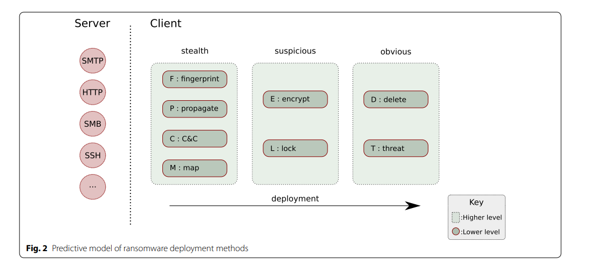
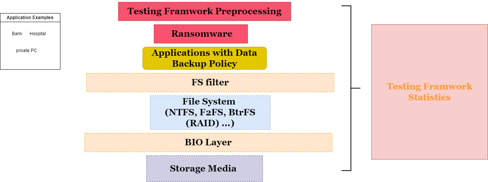
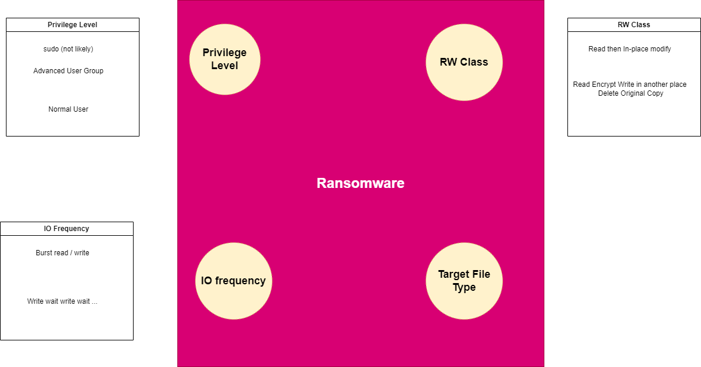
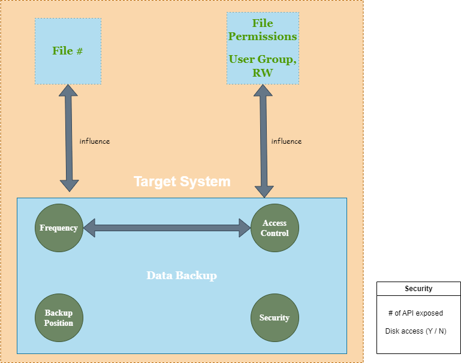
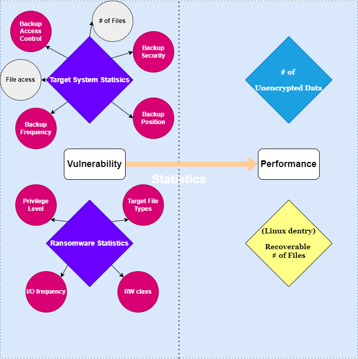
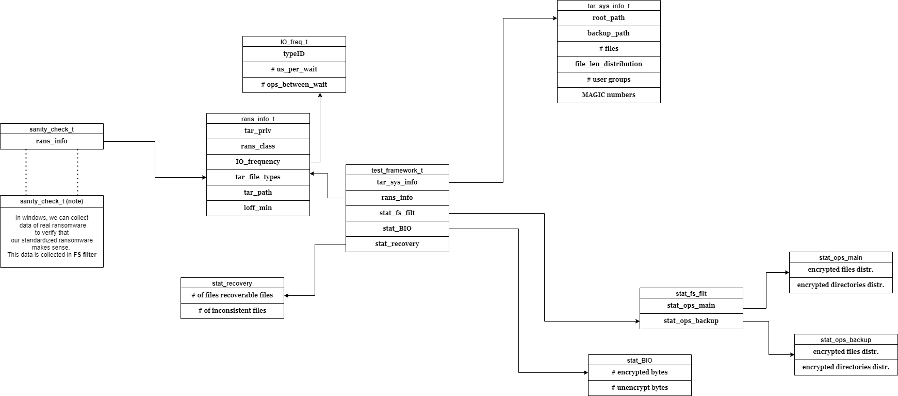

# Ransomware Testing Framework

---

## Overview of Ransomware Pattern

[Report](https://crimesciencejournal.biomedcentral.com/articles/10.1186/s40163-019-0097-9)

---

# Testing Framework Structure

For banks, hospitals, private PC, etc. they store files in their system (our target system).

Ransomware reads files in our target system, encrypt it, then overwrite them(in-place or delte then create new copies).

The testing framework detects how susceptible the target system is to ransomware.

It collects data in **target system** (preprocessing), **FS filter** (VFS in Linux) layer as well as **BIO layer**. It also optionally collects data with **standardized ransomware** to illustrate the pattern of attack and verify the sanity of other satistics.

---

---

## Standardized Ransomware (encryption and deletion)

---

---

## Target System (fingerprinting)

---

---

## Statistics

---

---

## Data Structure

---

---

# Basic Implementation

---

## Clone target system, and backup to a safe place

---

## Migrate / Prepare Target System & Preprocess `tar_sys_info` 

---

## Add magic numbers to files in target file system

MAGIC number should be 8 bytes (to avoid collision) to help BIO layer gather more information more easily.

---

## Launch standardized ransomware, with `rans_info` prepared

---

## When running ransomware

* In standardized ransomware, fill in `stat_fs_filt`
* In BIO, fill in `stat_BIO`.

[BIO tracing in Linux](https://www.ibm.com/docs/en/linux-on-systems?topic=blktrace-data-io-requests)

---

## Currently implemented

* Target System & Databackup Generation
* Fine-grained Access Control (via ACL) 
* Fingerprinting Report
* Ransomware Encryption

---

## TO DO

* BIO dump
* Data backup
  * consistency report
  * security report (To discuss)
* Propagation
