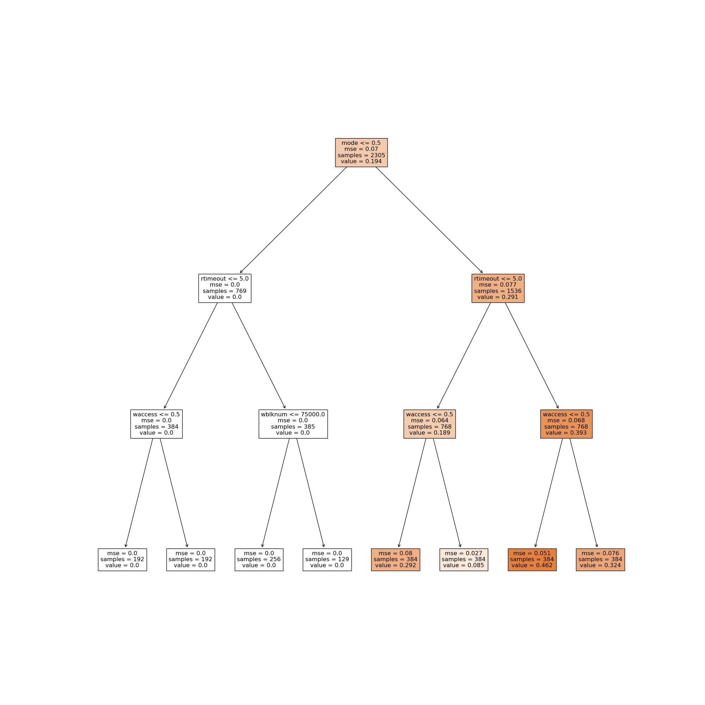
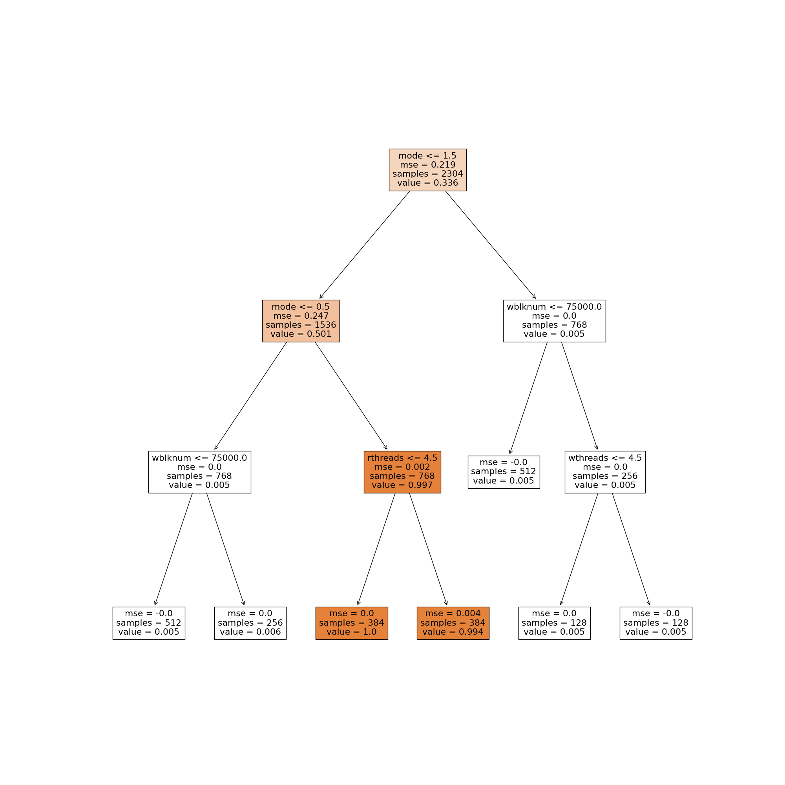
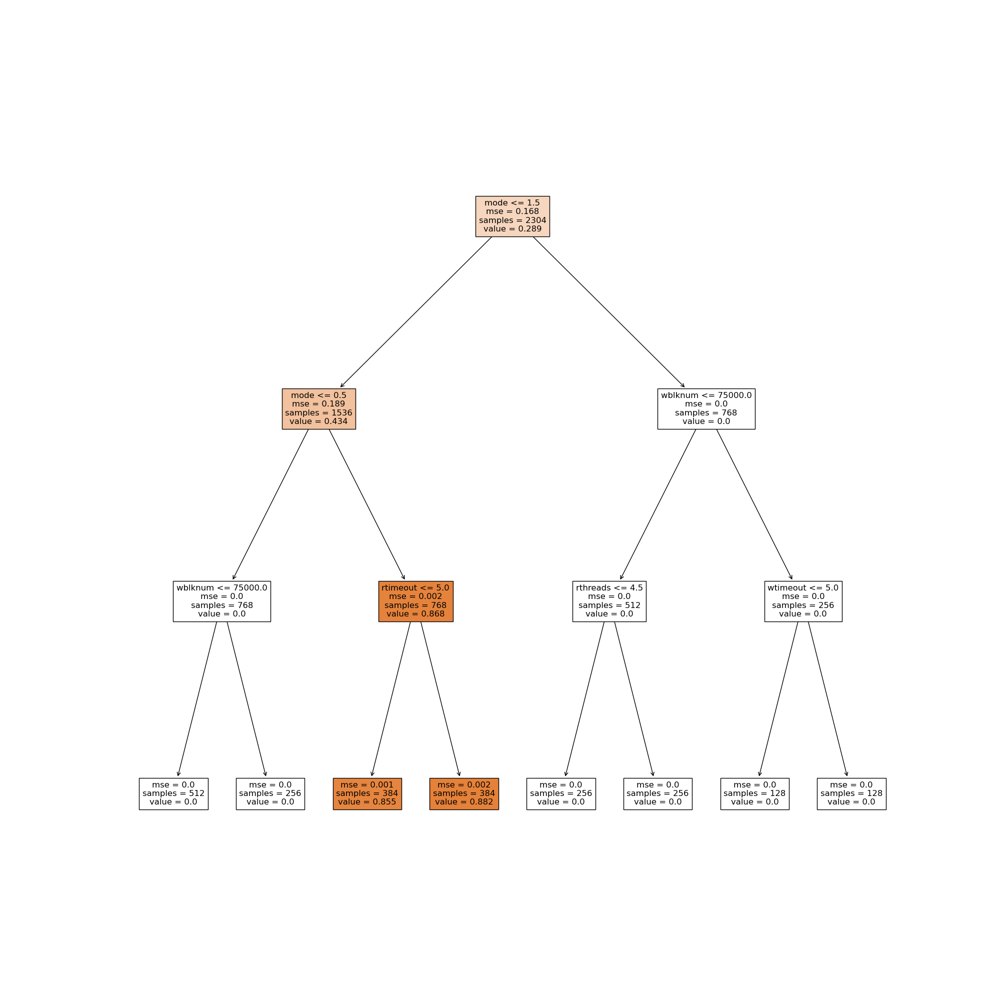
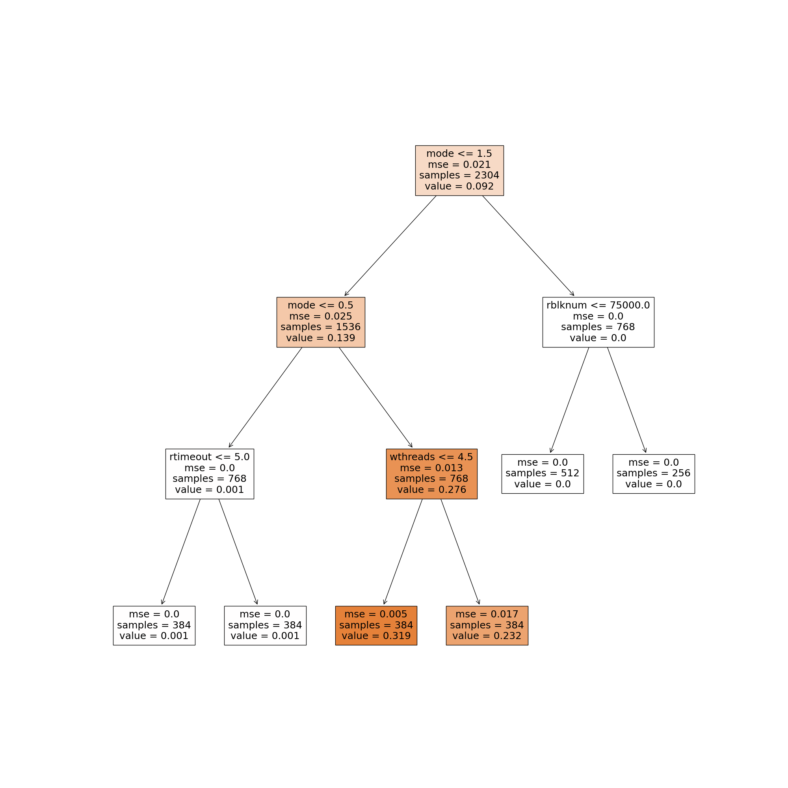
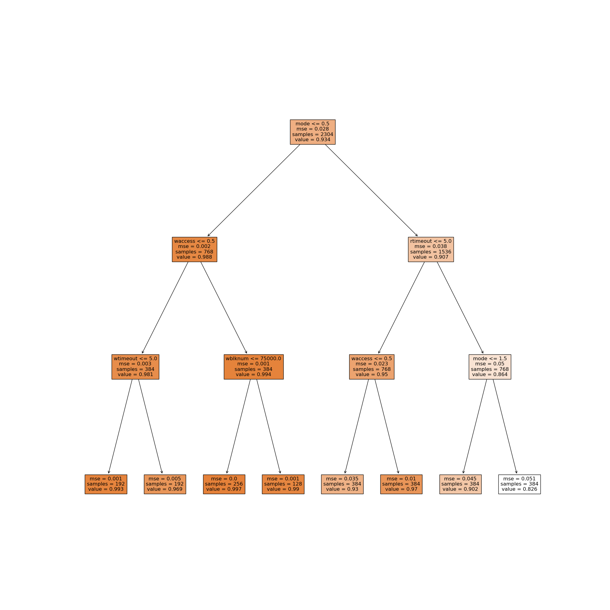

<style>
img[alt~="center"] {
  display: block;
  margin: 0 auto;
}
</style>

# Testing Local Storage System

---

## Review : How to test local storage system

---


1. Creating file system image. A real storage system originally has a set of objects stored in disk and in cache. We create different file distribution with different fragmentation degree in disk. This is done via this [paper](https://www.usenix.org/legacy/events/fast09/tech/full_papers/agrawal/agrawal.pdf).

---

2. Inject diverse and representitive testing files into the system. Because original file system image is too large and has sensitive information, it's important to only operate on the files we inject to obtain insights.

---


3. Obtain file2blk & blk2file mappings.

---


4. Maintain a Red-Black Tree to record the blocks associated with injected files. Originally, these blocks are marked as clean / recoverable.

---

5. Run a version of ransomware against the injected files. Record the block trace in the background.


---


6. Analyze the block trace. From blk2file mapping, if a block encrypted is associated with injected files, we find the corresponding node on the Red-Black Tree and mark it as unrecoverable.


---


7. Finally we calculate the recoverability of the storage system by looking at the ratio between `# clean block after ransomware attack` and `# clean blocks before ransomware attack`.


---

# Analysis of results

From the raw data obtained by the previous method, we get $2304$ `ransomware parameter` $\rightarrow$ `recoverability of storage system` mapping for each storage system.

---

## Ransomware Parameters (Features)

* mode (overwrite`O`, delete-create`D`, shred-create`S`)
* \# threads 
* access pattern (random`R`, sequential `S`)
* fsync after read (`Y` / `N`)
* read-write split (First read then write`Y` / read write happen concurrently`N`)
* blknum (after reading / writing # blocks, we trigger a timeout )
* timeout (the length of timeout in seconds)


---

## 2304 (minimum) Features for Ransomware

Among these features, `threads`, `access pattern`, `blknum`, `timeout` can be different for read and write.
* so there are 11 independent features in total

At minimum we have 2304 **combinations** of feature, the minimum setting is configured as follows

``` python
MODE = ['O', 'D', 'S'] # overwrite, delte, shred
TIMEOUT = ['0/0', '0/10', '10/0', '10/10'] # 0 means no timeout 10 means 10 seconds
BLKNUM = ['50000/50000', '50000/100000', '100000/50000'] # after this number of blocks, we trigger a timeout
THREADS = ['1/1', '1/8', '8/1', '8/8'] # number of threads
ACCESS  = ['R/R', 'R/S', 'S/R', 'S/S'] # access mode (random / sequential)
FSYNC = ['N', 'Y'] # whether to fsync (after rm / shred)
RWSPLIT = ['N' , 'Y'] # whether to split read and write
```

---

## Automated analysis : Decision Tree Regression

It's hard to analyze 2304 samples (mappings) manually, because we have ~10 reansomware features, each of which could influence recoverability of storage system.

* e.g. if we only have 1 feature (feature $A$) for a ransomware workload, then we can simply draw a `recoverability` against `feature` plot to see how feature $A$ influence the recoverability. 

To conquer the problem brought by high dimension of input, we utilize the [Decision Tree](https://scikit-learn.org/stable/modules/tree.html) to gain insights.


---

## Decision Tree (cont'd)

* Color of node represents the value

* The $condition$ is listed first in a node, a $condition$ should be in form of $feature <= val$
    * feature is mapped to interval [0, |feature| - 1] (e.g. mode = ['O', 'D', 'S'] is mapped to [0, 1, 2])
    * |feature| means how many values a feature can be.

* The value $x$(e.g. 0.91) of a node is the percentage of recoverable blocks  (e.g. 91% of blocks are recoverable).

* MSE value evaluates regression model for each node

* \# samples are also given to see how many samples meet $condition$

---

## Decision Tree (cont'd)

* Decision tree here is binary tree.

* Left son of the node means the $condition\ \text{is True}$

* Right son of the node means the $condition\ \text{is False}$


---

## EXT4

---



---

### Comments on EXT4

* `mode` is a dominating factor that influences the recoverability.

* During overwrite, EXT4 file system has 0 recoverability.

* Smaller timeout suggests smaller recoverability, (the recoverable blocks are more inclined to be reclaimed).

---

## F2FS


---




---

* Logs can not protect the system from overwrite.

* Logs can significantly increase recoverability under Delete-Create-Write workload

---

## NTFS

---



---

* 0 recoverability from overwrite and shred-create-write workload

* Higher recoverability than ext4 in Delete-create-write workload

---

## XFS

---



---

* 0 recoverability from overwrite and shred-create-write workload

* Similiar recoverability to EXT4

---

## BTRFS

---



---

* Very strong resilience to 3 modes

* Extremely high recoverability to overwrite 

* The recoverability is slightly impaired by shred-create-write workload.
